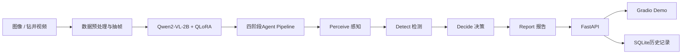
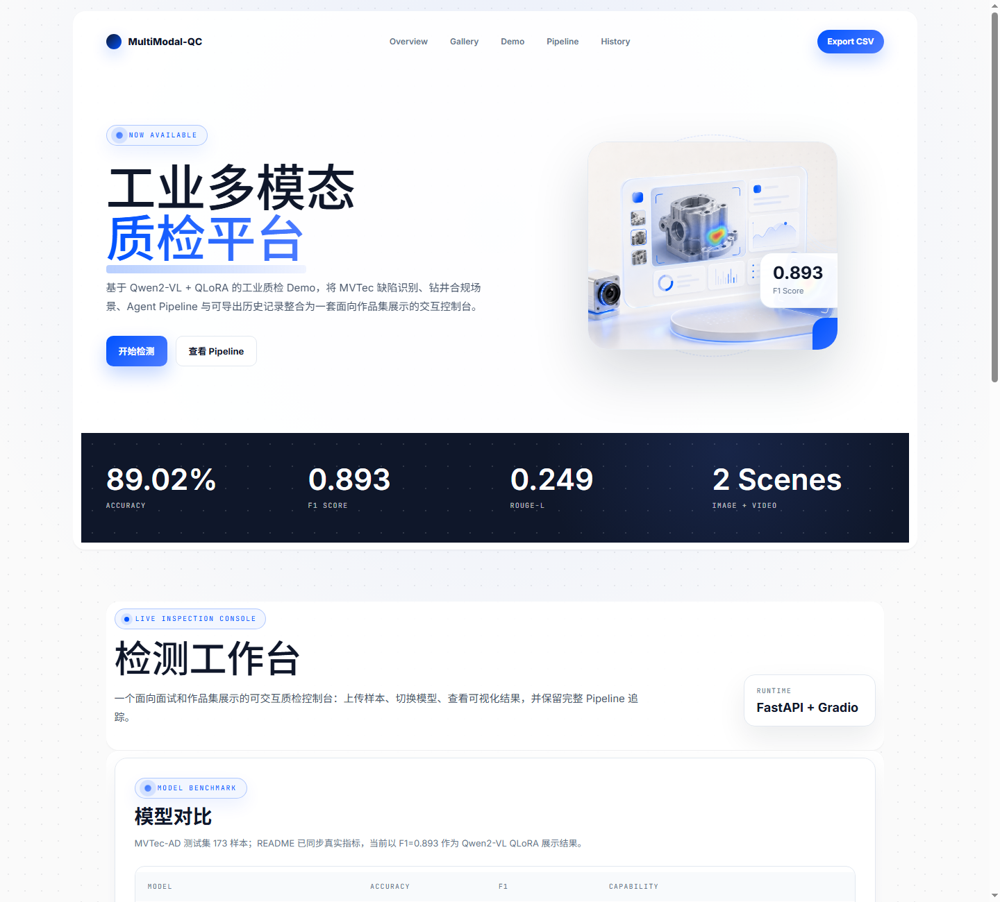
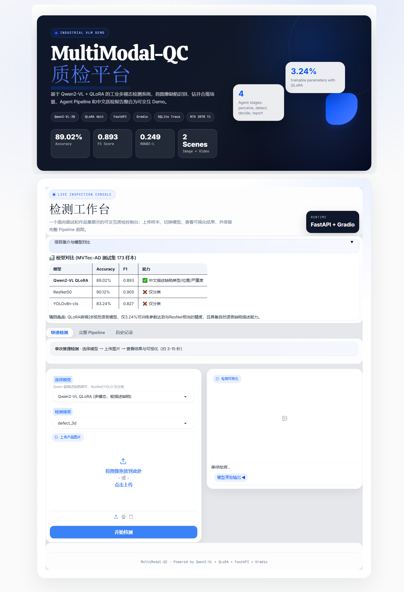
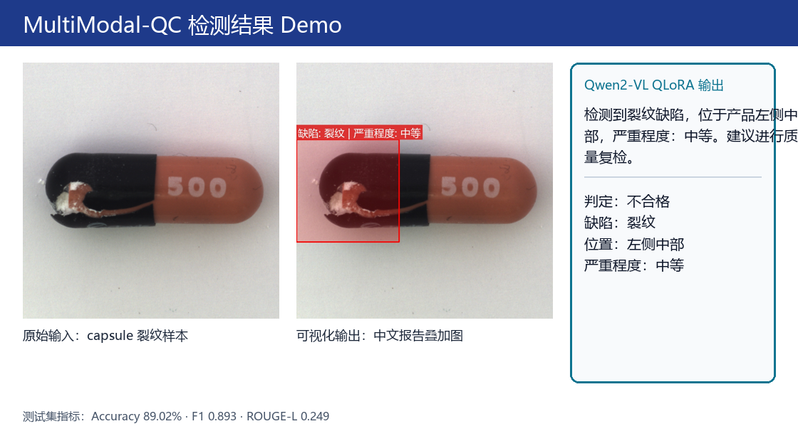
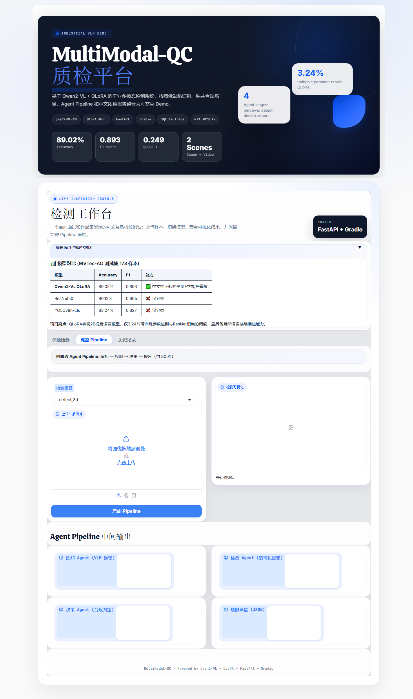
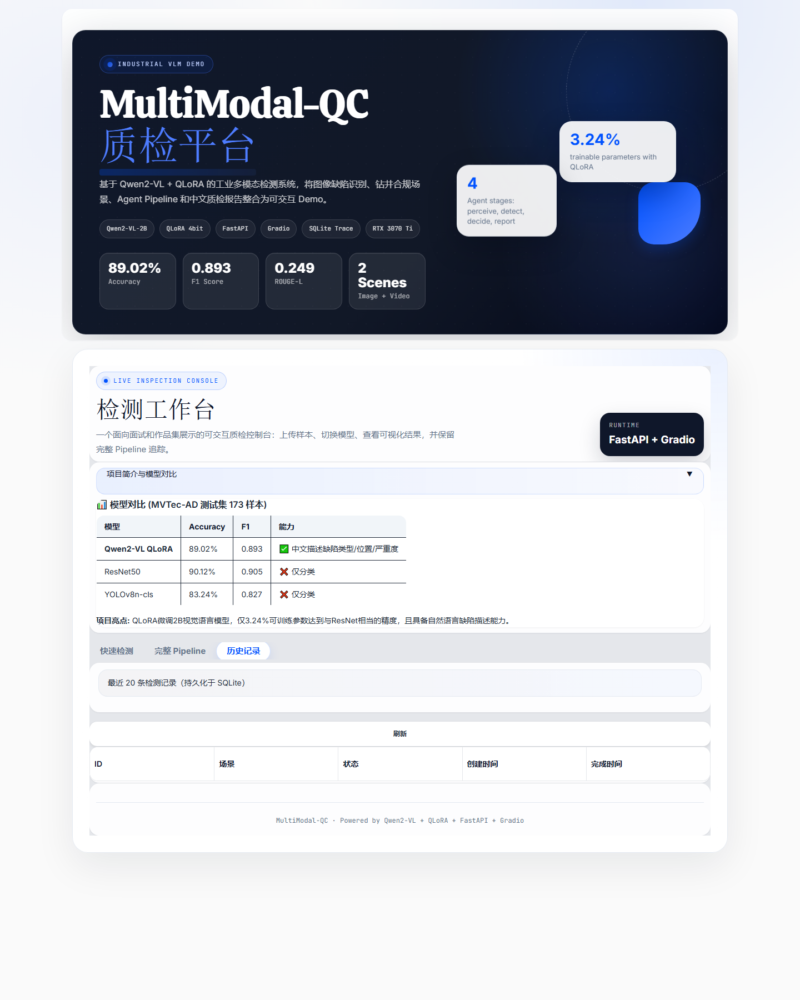

# MultiModal-QC 作品集展示页

## 项目定位

基于 Qwen2-VL-2B + QLoRA 的工业多模态缺陷检测平台，覆盖两个工业场景：

- 场景A：MVTec-AD 图像缺陷检测，输出缺陷类型、位置、严重程度和处置建议
- 场景B：钻井视频合规检查Demo，接入真实钻井视频和检查记录，生成中文合规检查说明

项目目标不是只做二分类，而是让模型像质检员一样给出**可复核、可追溯、可生成报告**的中文判断。

---

## 核心亮点

| 模块 | 内容 |
|------|------|
| 多模态模型 | Qwen2-VL-2B-Instruct + QLoRA 4bit微调 |
| 训练约束 | RTX 3070 Ti 8GB显存，使用LoRA适配器、NF4量化、bf16计算 |
| 对照实验 | ResNet50、YOLOv8n-cls传统Baseline |
| 双场景数据 | 1,725条MVTec图文QA + 2段钻井视频 + 约1,340条检查记录 |
| 工程交付 | FastAPI后端、Gradio前端、SQLite历史记录、Docker配置 |
| 可解释输出 | 缺陷类型、位置、严重程度、处置建议、中文质检报告 |

---

## 系统架构

---

## 实验结果

MVTec-AD测试集，n=173。

| 方法 | Accuracy | Precision | Recall | F1 | ROUGE-L | 输出能力 |
|------|----------|-----------|--------|-----|---------|----------|
| ResNet50 | 90.12% | — | — | 0.905 | — | 仅二分类 |
| YOLOv8n-cls | 83.24% | — | — | 0.827 | — | 仅二分类 |
| **Qwen2-VL-2B + QLoRA** | **89.02%** | **90.07%** | **89.02%** | **0.893** | **0.249** | 中文自然语言报告 |

结论：Qwen2-VL+QLoRA在F1上接近ResNet50，但额外具备中文缺陷解释能力，可直接生成质检报告。

---

## Demo截图

### 快速检测页

### 模型对比说明

### 检测结果样例

### 完整 Agent Pipeline 页

### 历史记录页

说明：以上截图来自本地 Demo 页面；检测结果样例使用 `capsule/test/crack/001.png` 作为输入样本，展示 Qwen2-VL QLoRA 的中文报告输出形式。

---

## 钻井场景说明

钻井场景已完成真实数据接入：2段原始作业视频 + 约1,340条Excel检查记录，并完成QA转换、视频抽帧和Demo场景接入。

当前限制：原始视频数量仅2段，Excel记录无法严格一一映射到每个视频片段，因此本阶段不宣称钻井场景独立训练指标。作品集中建议表述为：

> 已完成钻井视频合规检查数据接入与Demo展示，后续需补充更多带时间戳的视频标注以形成可靠训练集。

---

## 可放入简历的一句话

基于Qwen2-VL-2B与QLoRA 4bit微调构建工业多模态质检平台，在RTX 3070 Ti 8GB显存上完成训练，MVTec测试集F1达到0.893，并扩展钻井视频合规检查Demo，实现图像/视频输入、Agent推理、中文报告生成与历史记录追踪的端到端闭环。
