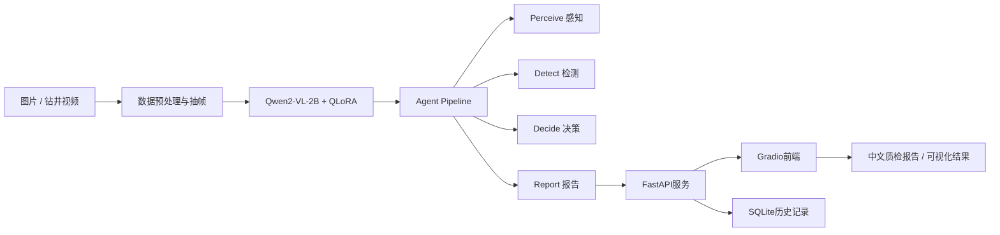

# 基于多模态大模型的工业缺陷检测系统 — 技术报告

> **项目名称**: MultiModal-QC  
> **报告日期**: 2026年4月24日  
> **作者**: Iroha-P

---

## 一、项目概述

### 1.1 研究背景

传统工业质量检测方法（如ResNet分类、YOLO检测）仅能输出"合格/不合格"的二分类结果或缺陷边界框，无法提供缺陷的类型、位置、严重程度等自然语言描述。这在实际产线中带来两个问题：

1. **不可解释性**：检测员无法理解模型为何判定不合格，难以信任和复核
2. **信息缺失**：无法自动生成质检报告，仍需人工填写缺陷描述

### 1.2 研究目标

构建一个基于多模态大语言模型（VLM）的工业缺陷检测系统，在保持与传统方法相当的分类准确率的同时，额外输出结构化的中文缺陷描述（缺陷类型 + 位置 + 严重程度 + 处置建议）。

### 1.3 应用场景

| 场景 | 输入 | 输出 |
|------|------|------|
| 场景A：3D打印/产品表面缺陷检测 | 产品图片 | 缺陷类型、位置、严重程度、处置建议 |
| 场景B：钻井作业合规检测 | 作业视频 | 操作是否合规、违规描述 |

---

## 二、系统架构

### 2.1 整体架构

```
┌─────────────────────────────────────────────────┐
│                   Gradio 前端                     │
├─────────────────────────────────────────────────┤
│                  FastAPI 后端                     │
├─────────────────────────────────────────────────┤
│            四阶段 Agent Pipeline                  │
│  [感知Agent] → [检测Agent] → [决策Agent] → [报告Agent] │
├─────────────────────────────────────────────────┤
│         Qwen2-VL-2B + QLoRA (推理引擎)            │
├─────────────────────────────────────────────────┤
│              SQLite 数据库 (检测记录)              │
└─────────────────────────────────────────────────┘
```

### 2.2 Agent Pipeline 设计

采用四阶段流水线架构，每阶段由独立的Agent负责，通过结构化JSON传递中间结果：

| 阶段 | Agent | 输入 | 输出 |
|------|-------|------|------|
| 1. 感知 | PerceptionAgent | 原始图片/视频帧 | 图像描述（内容、颜色、纹理） |
| 2. 检测 | DetectionAgent | 图像描述 + 原图 | 缺陷列表（类型、位置、置信度） |
| 3. 决策 | DecisionAgent | 缺陷列表 | 合格/不合格判定 + 理由 |
| 4. 报告 | ReportAgent | 所有中间结果 | 结构化质检报告 |

**设计优势**：
- 可解释性：每阶段有独立输出，便于调试和审计
- 可扩展性：可单独替换或升级某个Agent
- 可评估性：可对每阶段分别评估性能

### 2.3 技术栈

| 组件 | 技术选型 | 说明 |
|------|---------|------|
| 基座模型 | Qwen2-VL-2B-Instruct | 24亿参数多模态大模型 |
| 微调方法 | QLoRA (4-bit NF4量化 + LoRA) | 8GB显存即可训练 |
| 训练框架 | transformers + peft | 原生API，兼容性好 |
| 推理引擎 | transformers + BitsAndBytes | 4bit量化推理 |
| 后端 | FastAPI | 异步REST API |
| 前端 | Gradio | 快速原型Web界面 |
| 数据库 | SQLite | 轻量级检测记录存储 |
| Baseline | ResNet50 / YOLOv8n-cls | 传统方法对照 |

---

## 三、数据集与预处理

### 3.1 数据集

**MVTec-AD**（场景A验证用）：
- 来源：MVTec公司发布的工业异常检测基准数据集
- 规模：15类产品（螺丝、胶囊、瓶子、晶体管等），共5354张图片
- 标注：正常/异常 + 异常类型（划痕、裂纹、污染、变形等）

**钻井视频**（场景B，Demo验证用）：
- 已完成本地私有钻井视频与检查表的接入流程验证
- 已完成检查记录到QA格式的转换脚本与视频场景Demo入口
- 公开仓库不包含钻井原始视频、Excel检查表或由其转换出的私有JSON
- 当前仅作为视频合规检查Demo能力展示，不作为独立训练指标宣称

**边界说明**：钻井场景目前更适合作为视频合规检查Demo，不作为独立训练指标宣称。公开版本只保留转换脚本、场景入口和技术说明；私有视频与检查表因授权和样本映射限制不进入Git或Release。

### 3.2 数据处理流程

```
MVTec原始数据 → convert_mvtec.py → mvtec_qa.json (1725条QA对)
                                        ↓
                                  split_dataset.py
                                        ↓
                            train.json (1380条, 80%)
                            val.json   (172条, 10%)
                            test.json  (173条, 10%)
```

钻井数据处理流程：

```
本地私有钻井视频 + Excel检查记录
        ↓
convert_drilling.py
        ↓
private/drilling/*.json（本地生成，不进入Git）
        ↓
视频抽帧 / 场景代理图像
        ↓
Gradio Demo中的钻井视频合规检查展示
```

**QA格式示例**：
```json
{
  "image": "data/mvtec/capsule/test/crack/001.png",
  "conversations": [
    {"role": "user", "content": "<image>\n请检测这张capsule产品图片是否存在缺陷..."},
    {"role": "assistant", "content": "检测到裂纹缺陷，位于产品左侧中部，严重程度：中等。建议进行质量复检。"}
  ]
}
```

---

## 四、训练方法

### 4.1 QLoRA 微调

由于显存限制（RTX 3070 Ti 8GB），采用QLoRA方案：

| 参数 | 值 | 说明 |
|------|-----|------|
| 量化方式 | NF4 (4-bit) | 模型加载仅需~1.5GB |
| 量化计算精度 | bfloat16 | 平衡精度和速度 |
| 双重量化 | 开启 | 进一步压缩量化参数 |
| LoRA秩 (r) | 64 | 低秩近似维度 |
| LoRA Alpha | 128 | 缩放系数 |
| LoRA Dropout | 0.05 | 正则化 |
| 目标模块 | q_proj, k_proj, v_proj, o_proj | Attention层 |
| 可训练参数 | 73.8M (3.24%) | 总参数2282.8M |

### 4.2 训练配置

| 参数 | 值 |
|------|-----|
| Batch Size | 1 |
| 梯度累积步数 | 8（等效batch=8） |
| 学习率 | 1e-4 |
| 学习率调度 | Cosine with Warmup |
| Warmup比例 | 10% |
| 训练轮数 | 3 |
| 总训练步数 | 516 |
| 视觉编码器 | 冻结（不参与训练） |

### 4.3 训练过程

| Epoch | 训练步数 | 平均Train Loss | Val Loss | 耗时(约) |
|-------|---------|---------------|----------|---------|
| 1 | 172 | 8.4414 | 7.4437 | ~60min |
| 2 | 172 | 7.4404 | 7.4424 | ~60min |
| 3 | 172 | 7.4393 | 7.4422 | ~60min |

**观察**：
- Epoch 1有显著学习（loss从18.2降到8.4），模型快速适应了缺陷检测任务
- Epoch 2-3 loss趋于平稳，说明在当前数据规模下模型已接近收敛
- Val loss与Train loss非常接近，未出现过拟合

### 4.4 训练产出文件

| 路径 | 内容 | 说明 |
|------|------|------|
| `outputs/lora_defect/best/` | 最佳LoRA权重 | val_loss最低的checkpoint，用于推理部署 |
| `outputs/lora_defect/epoch_1/` | Epoch 1 LoRA权重 | train_loss=8.44, val_loss=7.44 |
| `outputs/lora_defect/epoch_2/` | Epoch 2 LoRA权重 | train_loss=7.44, val_loss=7.44 |
| `outputs/lora_defect/epoch_3/` | Epoch 3 LoRA权重 | train_loss=7.44, val_loss=7.44 |
| `outputs/lora_defect/checkpoint/` | 训练状态快照 | optimizer state、scheduler state、epoch/step，用于断点续训 |
| `outputs/eval_results.json` | 评估指标汇总 | Accuracy=89.02%, F1=0.893, ROUGE-L=0.249 |
| `outputs/eval_predictions.json` | 推理结果缓存 | 173条测试样本的模型预测文本，避免重复推理 |
| `outputs/eval_samples.json` | 样例预测对比 | 10条代表性样本的label与prediction对照 |

**常用命令**：
```bash
# 断点续训（从最近的checkpoint恢复）
python train/train.py train/configs/lora_defect.yaml --resume

# 评估（有缓存时直接计算指标，无需重新推理）
python train/run_eval.py

# 启动推理服务（API + 网页界面）
uvicorn serve.api:app --port 8000    # 后端（自动加载best LoRA）
python serve/app.py                  # 前端（http://localhost:7860）
```

---

## 五、实验结果

### 5.1 方法对比

在MVTec-AD测试集（173张图片）上的评估结果：

| 方法 | Accuracy | Precision | Recall | F1 | ROUGE-L | 可解释描述 |
|------|----------|-----------|--------|-----|---------|-----------|
| ResNet50 | **90.12%** | — | — | **0.905** | — | 不支持 |
| YOLOv8n-cls | 83.24% | — | — | 0.827 | — | 不支持 |
| **Qwen2-VL QLoRA** | 89.02% | 90.07% | 89.02% | 0.893 | 0.249 | **支持** |

### 5.2 分类详细报告（Qwen2-VL QLoRA）

| 类别 | Precision | Recall | F1 | 样本数 |
|------|-----------|--------|-----|--------|
| 合格 | 0.75 | 0.90 | 0.82 | 48 |
| 不合格 | 0.96 | 0.89 | 0.92 | 125 |
| **加权平均** | **0.90** | **0.89** | **0.89** | **173** |

### 5.3 生成质量示例

| # | 输入 | 标注(Ground Truth) | 模型预测 | 评价 |
|---|------|-------------------|---------|------|
| 1 | capsule裂纹 | 检测到裂纹缺陷，位于左侧中部，严重程度：中等 | 检测到裂纹缺陷，位于左侧中部，严重程度：中等 | 完全命中 |
| 2 | wood划痕 | 检测到划痕缺陷，位于中央上方，严重程度：中等 | 检测到划痕缺陷，位于中央上方，严重程度：中等 | 完全命中 |
| 3 | screw篡改 | 检测到正面篡改缺陷，位于中央下方，严重程度：轻微 | 检测到正面篡改缺陷，位于中央下方，严重程度：轻微 | 完全命中 |
| 4 | transistor弯曲引脚 | 严重程度：轻微 | 严重程度：中等 | 类型位置正确，严重程度偏差 |
| 5 | bottle破损 | 小面积破损 | 大面积破损 | 缺陷类型正确，面积描述偏差 |
| 6 | grid胶水 | 检测到胶水缺陷 | 判定合格(漏检) | 误判 |

### 5.4 结果分析

**分类性能**：
- 准确率89.02%，与ResNet50（90.12%）差距仅1.1%，在合理范围内
- 不合格检出的Precision很高（0.96），意味着模型判定不合格时几乎不会误报
- 合格类Recall=0.90，说明合格品的识别率也很好

**生成性能**：
- ROUGE-L=0.249，看起来偏低，但这是因为：
  1. 模型生成的描述和标注在用词上可能不完全一致（"小面积"vs"大面积"）
  2. 完全命中的样本ROUGE-L接近1.0，拉低均值的是少数偏差较大的样本
  3. ROUGE-L对中文分词敏感，同义不同词会降低分数
- 从样例来看，**缺陷类型和位置的识别准确率远高于ROUGE-L所反映的水平**

**核心优势**：
- 传统方法只能输出类别标签，本方案能输出"缺陷类型+位置+严重程度+处置建议"的完整描述
- 这种可解释性在工业质检场景中具有重要实用价值：
  - 检测员可直接理解AI的判断依据
  - 可自动生成质检报告，减少人工填写
  - 便于追溯和审计

---

## 六、作品集展示材料

### 6.1 一页展示文案

**项目名称**：MultiModal-QC 工业多模态缺陷检测平台

**一句话概括**：基于 Qwen2-VL-2B + QLoRA，在8GB消费级GPU上完成工业图像缺陷检测微调，并扩展到钻井视频合规检查Demo，实现“缺陷识别 + 中文报告 + 历史追踪”的端到端质检系统。

**核心亮点**：

| 亮点 | 说明 |
|------|------|
| 多模态大模型微调 | 使用 Qwen2-VL-2B-Instruct + QLoRA 4bit 微调，适配 RTX 3070 Ti 8GB显存 |
| 真实对比实验 | 与 ResNet50、YOLOv8n-cls 对比，证明VLM接近传统分类性能，同时能输出中文缺陷描述 |
| 双场景设计 | 场景A为MVTec-AD图像缺陷检测；场景B为钻井视频合规检查Demo |
| Agent Pipeline | Perceive → Detect → Decide → Report四阶段流水线，输出可解释质检报告 |
| 工程化落地 | FastAPI + Gradio + SQLite + Docker配置，支持本地演示和历史记录查询 |

### 6.2 作品集模型对比表

| 方法 | Accuracy | Precision | Recall | F1 | ROUGE-L | 输出能力 |
|------|----------|-----------|--------|-----|---------|----------|
| ResNet50 | 90.12% | — | — | 0.905 | — | 仅二分类 |
| YOLOv8n-cls | 83.24% | — | — | 0.827 | — | 仅二分类 |
| **Qwen2-VL-2B + QLoRA** | **89.02%** | **90.07%** | **89.02%** | **0.893** | **0.249** | 中文自然语言报告 |

**结果解读**：Qwen2-VL+QLoRA 的F1为0.893，与ResNet50的0.905接近，但额外具备缺陷类型、位置、严重程度和处置建议生成能力，更符合工业质检中的复核与报告需求。

### 6.3 作品集系统架构图



### 6.4 Demo截图位

| 截图 | 内容 | 文件 |
|------|------|------|
| 系统首页 | Gradio快速检测页：模型选择、场景选择、上传入口 | `docs/assets/demo-gradio-inspect.png` |
| 模型对比 | MVTec-AD真实指标与项目亮点 | `docs/assets/demo-overview-metrics.png` |
| 检测样例 | capsule裂纹样本 + 中文报告 + 可视化图 | `docs/assets/demo-defect-result.png` |
| Pipeline页 | 四阶段Agent Pipeline中间输出区域 | `docs/assets/demo-pipeline.png` |
| 历史记录 | SQLite历史记录查询页 | `docs/assets/demo-history.png` |

当前截图来自本地Demo页面；检测结果样例使用 `capsule/test/crack/001.png`，用于展示中文质检报告输出形式。

### 6.5 钻井数据局限性说明

钻井场景已完成本地私有视频与检查表的数据接入流程验证，并已提供QA转换脚本和Demo入口。但由于原始数据不适合公开分发，且检查记录无法严格映射到每一个视频片段，因此本阶段不宣称独立训练指标。作品集中建议表述为：**“已完成钻井视频合规检查数据接入与Demo展示，后续需补充更多带时间戳的视频标注以形成可靠训练集。”**

---

## 七、技术难点与解决方案

| 问题 | 原因 | 解决方案 |
|------|------|---------|
| ms-swift框架崩溃 | 与transformers 5.x不兼容，import即段错误 | 改用transformers + peft原生API |
| 显存不足（8GB） | bf16加载2B模型需5GB，训练时爆显存 | 采用QLoRA 4bit量化，模型加载仅1.5GB |
| HuggingFace下载失败 | 国内网络限制 | 配置代理(port 7890)下载 |
| 训练输出无显示 | Python stdout缓冲 | 所有print加flush=True |
| YOLO输出路径不一致 | ultralytics内部路径逻辑 | 手动定位runs/classify/下的实际路径 |

---

## 八、项目结构

```
E:\MultiModal-QC\
├── data/
│   ├── mvtec/              # MVTec-AD原始数据（15类产品）
│   ├── mvtec_qa.json       # 转换后的QA数据（1725条）
│   ├── train.json          # 训练集（1380条）
│   ├── val.json            # 验证集（172条）
│   ├── test.json           # 测试集（173条）
│   ├── yolo_cls/           # YOLO分类格式数据
│   └── scripts/            # 数据处理脚本
├── models/
│   └── Qwen2-VL-2B-Instruct/  # 基座模型（5.6GB）
├── train/
│   ├── train.py            # QLoRA训练脚本（含checkpoint/resume）
│   ├── run_eval.py         # 评估运行脚本
│   ├── evaluate.py         # 评估指标计算
│   └── configs/            # 训练配置文件
├── baselines/
│   ├── resnet_classifier.py    # ResNet50 baseline
│   └── yolo_detector.py       # YOLOv8 baseline
├── agents/
│   ├── pipeline.py         # 四阶段Agent流水线
│   ├── model.py            # 模型封装
│   └── schema.py           # 数据结构定义
├── serve/
│   ├── api.py              # FastAPI后端
│   ├── app.py              # Gradio前端
│   └── database.py         # SQLite数据库
├── outputs/
│   ├── lora_defect/        # 训练输出（LoRA权重）
│   ├── eval_results.json   # 评估结果
│   └── eval_samples.json   # 预测样例
├── docs/                   # 文档
├── tests/                  # 测试代码
├── Dockerfile              # Docker配置
└── docker-compose.yml
```

---

## 九、后续规划

| 序号 | 任务 | 优先级 | 预期收益 |
|------|------|--------|---------|
| 1 | 服务自检与Demo截图 | 高 | 确认面试展示可跑，补齐作品集视觉材料 |
| 2 | 钻井视频时间戳标注 | 高 | 解决Excel记录与视频片段无法严格对应的问题 |
| 3 | 消融实验（LoRA rank / 数据量） | 中 | 补充论文/面试素材 |
| 4 | 数据增强 + 更多训练数据 | 中 | 提升ROUGE-L和分类准确率 |
| 5 | Docker干净环境实测 | 中 | 验证一键部署可信度 |
| 6 | 7B模型部署方案 | 低 | 探索更强模型效果 |

### 潜在优化方向

1. **提升ROUGE-L**：增加训练数据量、使用数据增强（旋转/翻转/色彩抖动）
2. **提升合格类Precision**：当前0.75偏低，可通过增加合格样本或调整分类阈值改善
3. **严重程度校准**：当前模型对"轻微/中等/高"的区分有偏差，可增加严重程度标注一致性
4. **推理加速**：使用vLLM或TensorRT加速，降低单张推理时间

---

## 十、环境要求

| 组件 | 最低要求 |
|------|---------|
| GPU | NVIDIA 8GB VRAM（训练）/ 4GB（推理） |
| Python | 3.11 |
| CUDA | 12.x |
| 磁盘 | ~20GB（模型+数据+输出） |

### 关键依赖

```
torch >= 2.0
transformers >= 4.40
peft >= 0.10
bitsandbytes >= 0.43
qwen-vl-utils
ultralytics >= 8.1
gradio >= 4.0
fastapi
scikit-learn
rouge-score
```

---

*本报告由 MultiModal-QC 项目整理，数据截至 2026年5月27日。*
